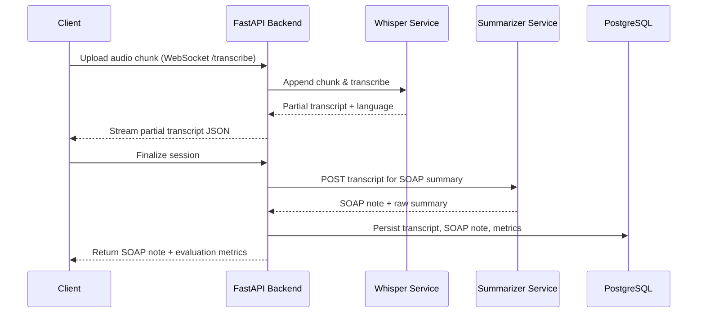

# Architecture Diagram

```mermaid
graph LR
    A[Audio Input (.wav/.mp3)] -->|WebSocket / REST| B[Whisper Transcription Service]
    B -->|Partial transcript stream| C[FastAPI Orchestrator]
    C -->|Transcript text| D[Summarization Model API]
    D -->|SOAP sections| E[SOAP Note Formatter]
    E -->|Structured note + summary| F[Evaluation Logger]
    F -->|ROUGE / BERTScore + transcripts| G[(PostgreSQL)]
    E -->|SOAP note + metrics| H[Next.js Dashboard]
    B -->|Streamed transcript updates| H
    G -->|Historical insights| H
```


